# Prerequisite to use this repo

## Problem statement 

MEDIAWIKI PROBLEM STATEMENT  

We want to automate the deployment of MediaWiki using.

Kubernetes with Helm Chart/ any equivalent automation with own Dockerfiles for application and database.
Terraform or any IaC tool with any Configuration Management tool integrated.

## Solution

I am choosing Method 3 & using Cloud as Azure . You can validate it two way  

a) Quick Run Locally

b) CI/ CD process  

I can also see some challenges on Scaling of this mediawiki app . Which are mentioned [over here](https://github.com/anurag4517/assignment#scaling-challenges-for-mediawiki).  
I have assumed minimal configurations of mediawiki app , there can also be certain security enhancements which are mentioned [over here](https://github.com/anurag4517/assignment#security-enhancements)  
### Quick run Locally
Step 1 : Ensure that you have full filled prerequisite .
Step 2:  Clone this project locally  

`git clone https://github.com/cloudpassion1801/assignment.git ;`  

Step 3: Create a local docker container environment to run flow . You can run these command locally too , but different configurations of different machines may impact flow .
So inorder to have consistent environment its best to run them inside a docer container  

` cd assignment ; `  
`docker build -t project .`  
`docker run --volume $(pwd):/app -it project /bin/bash ;`  
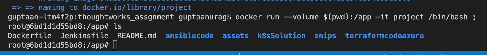  
Set credentials on container. These are the SP credentiails which was created before  
`export ARM_SUBSCRIPTION_ID="XXXXX-XXXXX-XXXXX"`  
`export ARM_TENANT_ID="XXXX-XXXX-XXXX-XXXX-"`  
`export ARM_CLIENT_ID="XXXX-XXXX-XXXX-XXXX" `  
`export ARM_CLIENT_SECRET="XXXXXXXXXXXXXXXXXX"`  

Step 4:  Create terrafrom infra  
`cd terraformcodeazure ; `  
   ` terraform init;`  
   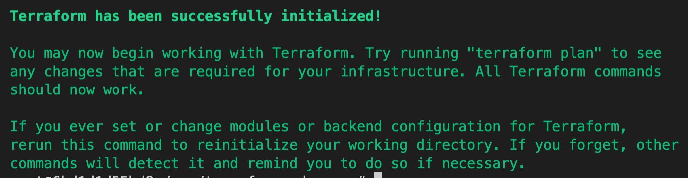
   ` terraform plan;`  
   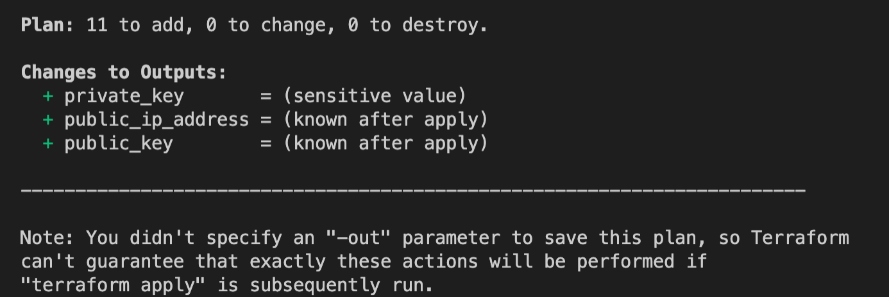
   ` terraform apply -auto-approve; `  
   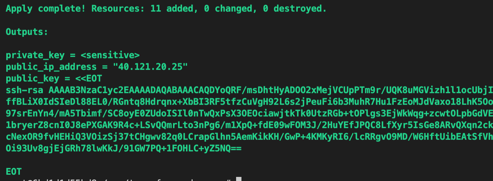
   This process will create basic infra required for running media wiki .  
   It will create a VM required for deploying app , below command will get private key & ip for connecting to the instance. 
   Configuration Management tool Ansible will need this to ssh and install mediawiki on VM  
   ` terraform output -raw private_key > id_rsa`  
   ` chmod 600 id_rsa`  
    `public_ip = ${terraform output -raw public_ip_address } `  

`Note: Here I have commented out backend for demo purpose, which is not the reccomended way , it is ideal to store backend on storage account to not loose state as well as working in parellel for teams`  
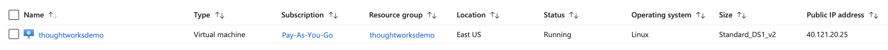
Step 5:  Validate created Infra  
Step 6:  Run configuration Management tool (Ansible) for installing mediawiki in VM  
I have written a script which just accepts public ip of VM and connects to vm via ansible and installs mediawiki on it.  
  
    `echo ${public_ip} ` 
    ` chmod 777 ansible.sh `   
    `./ansible.sh ${public_ip} `  
  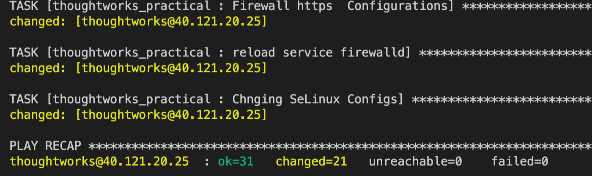  

Once this succeeds you can view mediawiki running n http://{ip_address} , where ip_address is ip of instance created on Azure  
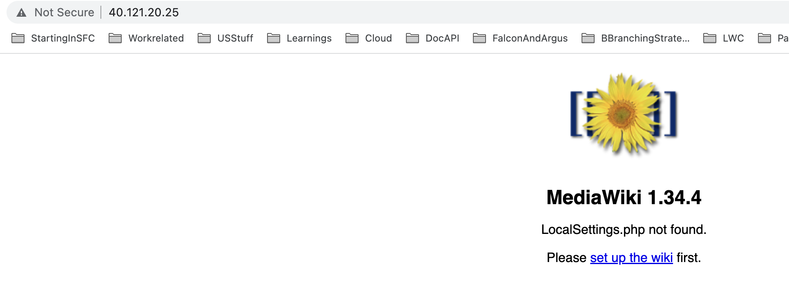
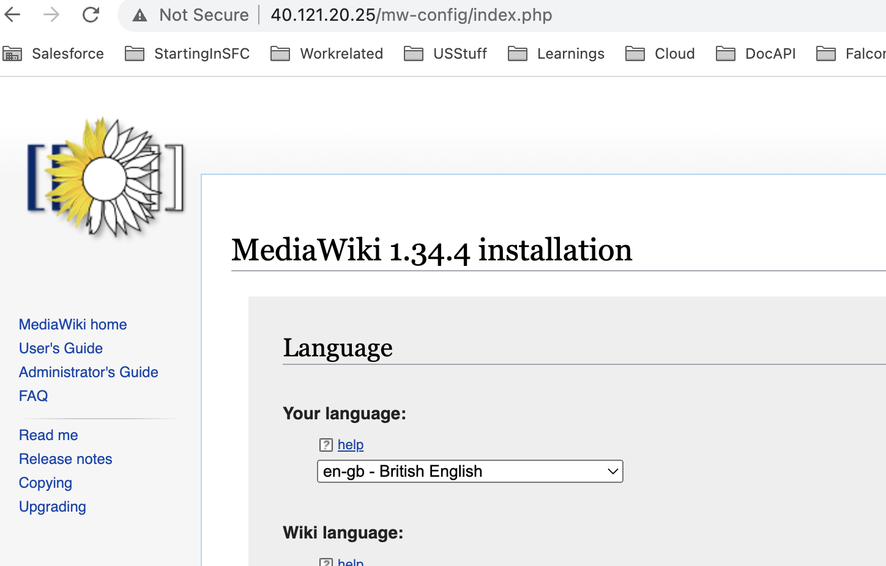  

#### Quick Run prerequisite  

a) Should have a valid Azure account and subscriptions & Install Azure cli . You can view documetation [here](https://registry.terraform.io/providers/hashicorp/azurerm/latest/docs/guides/service_principal_client_secret) .  

b) Should have created a SP(Servic principle) in Azure with Contributor Access to help terraform create resources . You can find details [here](https://github.com/anurag4517/assignment#code-for-creating-sp-for-azure) . 

c) Docker should be installed locally on system.  

### CI/CD Process  

A CI/CD process needs 2 seperate environments one for stage and other for production .  
When a user creates a PR terraform code/app is deployed on stagging environment. Once user validates he can merge PR .  
On PR merge the code in default branch is deployed on Prod environment .  (Ensure there is branch protection on main , so that no one accidently deletes prod branch)
In our case for demo purpose we are destroying code in stagging after merge as we want to save money .(But this is not ideal)
As this is demo so we are using same subscription for both prod and stagging . Every prod environment resource woukd be appended with prod prefix to identify correctly

Step 1 : Ensure that you have full filled [CI/CD prerequisite](https://github.com/anurag4517/assignment#entire-cicd-prerequisite) .  

Step 2 : [Run Jenkins Server Locally](https://github.com/anurag4517/assignment#step-1--run-jenkins-server-locally-via-following-command) . Ideally we should have a Jenkins CI server running where we would configure our job , but here we are running it locally via docker container .

Step 3 : [Configure Jenkins credentiails](https://github.com/anurag4517/assignment#configure-your-jenkins-credentials) .  

Step 4 : [Create a PR to deploy infra to stagging environment](https://github.com/anurag4517/assignment#create-a-pr-to-deploy-infra-to-stagging-environment)  

Step 5 : [Validate app in stagging environment](https://github.com/anurag4517/assignment#create-a-pr-to-deploy-infra-to-stagging-environment) and once validated merge PR to main to deploy it to prod  

Step 6 : Validate app in prod environment.  

### Entire CI/CD prerequisite  

For complete CI/CD examination you need to have below things

a) Should have a valid Azure account and subscriptions & Install Azure cli . You can view documetation [here](https://registry.terraform.io/providers/hashicorp/azurerm/latest/docs/guides/service_principal_client_secret) .  

b) Should have created a SP(Servic principle) in Azure with Contributor Access to help terraform create resources . You can find details [here](https://github.com/anurag4517/assignment#code-for-creating-sp-for-azure) . 

c) Docker should be installed locally on system.  

d) Run Jenkins Server Locally . Ideally we should have a Jenkins CI server running where we would configure our job , but here we are running it locally via docker container .

e)  Configure Jenkins credentiails .

f) Ensure that your main branch(default) is protected so that it is not deleted accidently

### Code for creating SP for Azure 

`az ad sp create-for-rbac --name thoughtworks --role Contributor --scopes /subscriptions/{yourSubcriptionId}`

Output will Look like something below : 
`{
  "appId": "XXXXXXX-202b-4fe4-be81-XXXXXXX",
  "displayName": "thoughtworks",
  "password": "XXXXXXXXXXXXXXXXXX",
  "tenant": "4e38ff80-f300-XXXXXXXXX"
}`

### Step 1 : Run Jenkins Server Locally via following command.  

`docker run --privileged -u 0 -p 8081:8080 -p 50000:50000 -v $(pwd)/jenkinsjob:/var/jenkins_home  jenkins/jenkins:lts-jdk11` 

Open `http:\\localhost:8080`

### Configure Your Jenkins credentials  

(SP --> appId , password , tennant , Subscription ID )

Manage Jenkins > Credentials > Add 

Add 3 credentials Namely `APP_ID` `APP_PASSWORD` `APP_TENANT`  
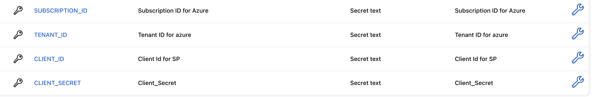

### Create a PR to deploy infra to stagging environment  
As we have deployed Jenkins in Localy via docker container and github pull request binder would work for Publically deployed Jenkins server . So for this purpose I have created a seperate branch for stage request.  
Any content on stage branch would be deployed on stage environment via Jenkinsfile_stage .

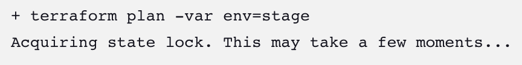

### Validate app in stagging environment
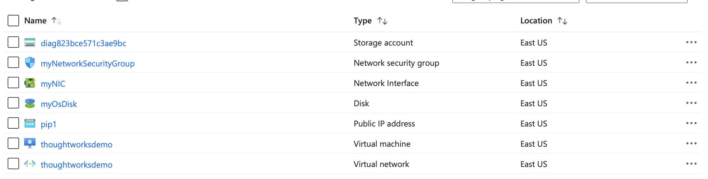

### Validate app in prod environment
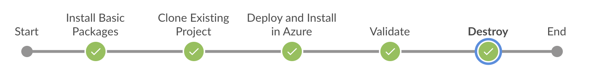

### Scaling challenges for mediawiki  
Issue 1 : Single point of failure --> As our vm is hosting our app for this demo this is single point of failure if vm goes down our app is down  
Possible solution to issue 1 --> Use a Load balancer to balance traffic between multiple instances and expose Load balancer to piblic ip  
Issue with above solution 1 (Issue 2) --> As currently our both db and app is hosted on same VM , creating multiple vm's will have multiple db , which won't be consistent
Possible solution to Issue 2 -->  Host single Db in a different VM and app behind a loadbalancer as they would be on same network , app would be able to connect to db 
Issue with above solution 2 (Issue 3) --> Any other app which is colocated within same subnet would be able to connect to db , which is security threat
Possible solution of Issue 3 --> Host db in other subnet and configure db subnet to only accept incoming request form load balancers target hosts on db port .  
Issue with above solution 3 Issue 4 --> Now app is scalable but we only have one db to serve request , as load increases it may crash .
Possible solution to Issue 4 --> We can scale db vm's also , but in read replica's fashion we know that there would majorly be read request to db , So we can direct read request to all read replicas and write request to primary instance , from there we can have sync mechanism to sync data
Issue with solution 4 --> We have to choose which type of sync we need to have Async or Sync both have thier tradeoffs.  

## Security Enhancements 

### a) Using Backend to store terraform state file (Storage Account blob)  

Currently state file is stored locally anyone can access it and can use it to get sensitive data , We can created a Azure Storage account with container  and configured it as backend + enabled encryption on it so that our state file could be shred accross various developers .
Due to encryption its data is also not interpretted by anyone .

### b) Using Jenkins Plugin to store Azure SP secret Access Key  
Before doing terraform apply we have to configure AWS secret and Access key ID to authenticate terraform with your AWS cloud . We have used Global jenkins configuration to store that information , so that no one could steal your credentials . Only Jenkins admin should have authorization to change those credentials

### c) Sensitive O/P Parameters are encoded  

### d) Encrypted ansible vars file via Ansible Vault (Still to be implemented ,More efficient method is using Ansible tower and credentials .Need more time for same ETC : 1 day )  
There might be some sensitive parametes which should not be stored normally on Source control . We should encrypt then via ansible vault and use credentils to store key of it and call the template using Ansible tower api key via http.  

### e) Secure db connectivity  
We can deploy db in seperate subnet and can configure NSG's  to only accept incoming request from app-servers , thus by preventing it from global access 

### f) SSH protection  
As we are running ansible in a docker container and ansible needs ssh connectivity to host so for now we have opened port 22 , which is not best security practice  

### g) DDOS protection

When application is exposed to external world there can be DDOS attacks , in order to protect them we must enable Azure DDOS protection to prevent from such attacks .  

## ******** Organized Folder structure ***********
Now All code is organized into 3 folders  
a) Terraform code : All terraform related code is stored over here   
b) Ansible Code: All ansible related is stored over here    
c) Jenkins Job Info : Volume reserved for jenkins build related activities  
d) Jenkinsfile : Contains Jenkins Pipeline related Code  
